# MongoDB-WEB-DEMO
​	基于Springboot+Vue+MongoDB构建的Demo，仿电商应用

## 环境配置说明

### 1.mongodb安装配置

​	参考mongodb官网配置，构建mongdb相关数据库配置，创建eb_db collection作为本次项目数据库支撑，数据库访问用户名、密码如下链接所示：

```java
mongo --host 127.0.0.1 -u "myuser" --authenticationDatabase "eb_db" -p'000000'
```

​	可借助mongodb compass可视化界面辅助操作

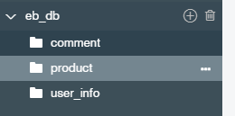

### 2.idea环境配置

​	安装idea开发工作，导入项目（File->Open指定EbProject项目路径），随后配置jdk环境和maven依赖相关内容，启动项目进行测试

​	可借助postman辅助测试（测试接口是否连通），后续前端搭建完成之后则可直接跨域联调（此处引用了shiro框架验证，有一定的校验规则和限制，测试的时候可以取消掉ShiroConfig配置，或者是直接前后端联调即可）

```properties
后台接口访问路径：基路径和关联的映射路径搭配
localhost://127.0.0.1:8080/ebProject/[对应controller]/[对应method映射]
```

> jdk配置说明

​	File->Project Structure

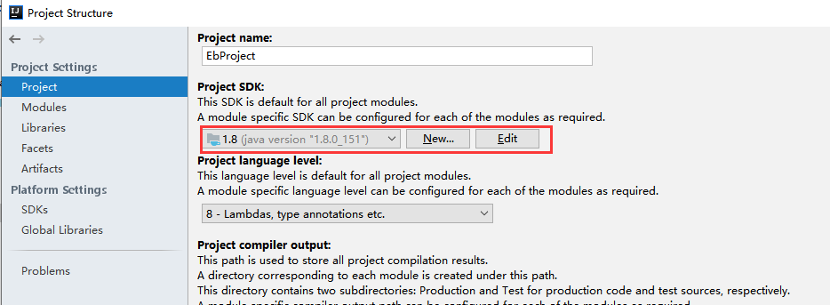


> maven配置说明

​	File->setting->File | Settings | Build, Execution, Deployment 选项卡->Maven

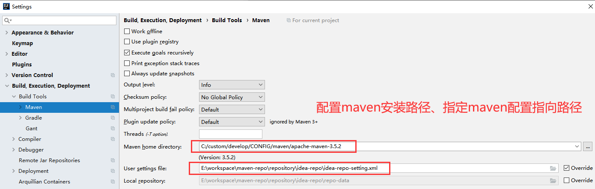


> 配置完成，启动DemoApplication项目

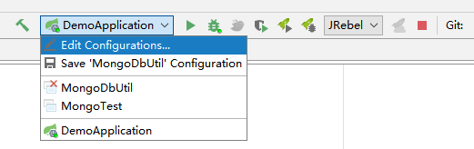


> 项目启动成功参考示例

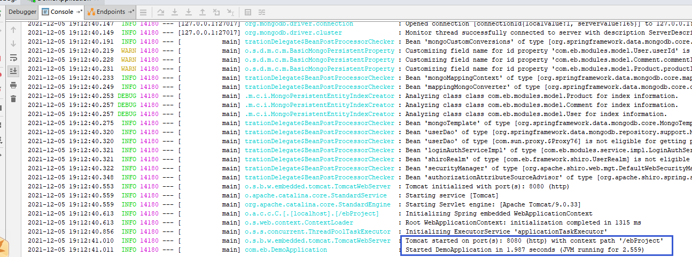

### 3.vue环境配置

​	vue环境配置相关内容：相应参考vue官网构建node.js和vue开发环境，随后导入`EbProject-vue`前端项目，加载依赖，启动项目即可

```properties
导入项目：执行npm install/cnpm install
启动项目：npm run dev /npm start
打包项目：npm run build
```

```properties
前端访问路径：一般以实际项目启动为参考（如果是合并部署概念则跟着项目走）
一般是localhost:8080(实际端口号以具体应用为参考调整)
```

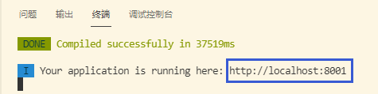

## 系统设计说明

#### 1.系统功能

> 商城首页

​	用户可浏览商品信息，查看商品评论记录并对商品做出评论


> 用户管理

​	商城用户分为普通用户和商城管理员，普通用户可浏览商品基本信息、查看商品评论记录并对商品做出相关评论内容；管理员则可管理商品后台基本信息，进行用户信息维护、商品信息维护、评论信息维护等操作


> 商品管理

​	商品管理主要用于维护商品基本信息，控制商城首页商品信息展示内容（按照分类进行数据展示）


> 评论管理

​	评论管理主要用于维护商品评论信息


#### 2.数据库设计

<center>数据表设计</center>

| 序号 | 数据表    | 说明       |
| ---- | --------- | ---------- |
| 1    | user_info | 用户信息表 |
| 2    | product   | 商品信息表 |
| 3    | comment   | 评论信息表 |

​	基于MongoDB操作，实体类和对应“文档属性”意义对应，亦可借助Map<String，Object>处理data信息

- 用户信息：user_info

| 字段名称   | 数据类型    | 是否为空 | 备注                                 |
| ---------- | ----------- | -------- | ------------------------------------ |
| userId     | varchar(40) | 否       | 主键ID（objectId）                   |
| userName   | varchar(40) | 否       | 用户名                               |
| password   | varchar(2)  | -        | 密码                                 |
| email      | varchar(40) | -        | 邮箱                                 |
| mobile     | varchar(40) | -        | 手机号                               |
| userStatus | varchar(2)  |          | 账号状态<br />（0-禁用；1-正常）     |
| remark     | varchar(40) | 否       | 备注信息                             |
| userRole   | number(20)  | 否       | 用户角色（1-系统管理员；2-普通用户） |
| createBy   | varchar(40) | -        | 创建人                               |
| modifyBy   | varchar(40) | -        | 修改人                               |
| createTime | datetime    | -        | 创建时间                             |
| modifyTime | datetime    | -        | 修改时间                             |
|            |             |          |                                      |


- 商品信息：product

| 字段名称    | 数据类型     | 是否为空 | 备注                        |
| ----------- | ------------ | -------- | --------------------------- |
| productId   | varchar(40)  | 否       | 商品id（主键objectId）      |
| productNum  | varchar(40)  | 否       | 商品编号                    |
| classify    | varchar(2)   | -        | 商品分类                    |
| productName | varchar(40)  | 否       | 商品名称                    |
| picUrl      | varchar(40)  | -        | 图片路径                    |
| stock       | number(20)   | 否       | 库存                        |
| vendor      | varchar(40)  | /        | 供货商                      |
| handler     | varchar(40)  |          | 处理人（外键-关联管理员id） |
| remark      | varchar(200) |          | 备注信息                    |
| createBy    | varchar(40)  | -        | 创建人                      |
| modifyBy    | varchar(40)  | -        | 修改人                      |
| createTime  | datetime     | -        | 创建时间                    |
| modifyTime  | datetime     | -        | 修改时间                    |
|             |              |          |                             |


- 评论信息：comment

| 字段名称    | 数据类型    | 是否为空 | 备注                        |
| ----------- | ----------- | -------- | --------------------------- |
| commentId   | varchar(40) | 否       | 评论记录id（主键）          |
| productId   | varchar(40) | 否       | 评论商品（外键-关联评论人） |
| content     | varchar(2)  | -        | 评论内容                    |
| commentor   | varchar(40) |          | 评论人（外键-关联用户id）   |
| isAnonymous | varchar(2)  |          | 是否匿名<br />0-非；1-匿名  |
| commentTime | datetime    | -        | 评论时间                    |
|             |             |          |                             |


## 系统测试说明

### 1.数据库初始化

​	先在eb_db集合下创建user_info结合，插入一条数据作为后续管理员测试系统功能

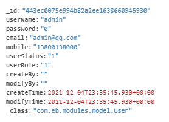

### 2.前后端项目联调

​	项目配置完成，则前后端联调（启动项目进行跨域联调）

#### 前台页面

​	访问vue主页：http://localhost:8001/#/home


​	随后访问各个功能模块应用即可，对照借助compass工具查看mongodb数据库的变动

#### 后台页面

> 后台管理员

- 用户管理

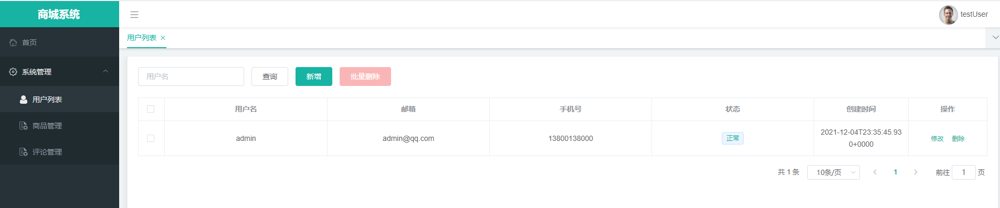

- 商品管理

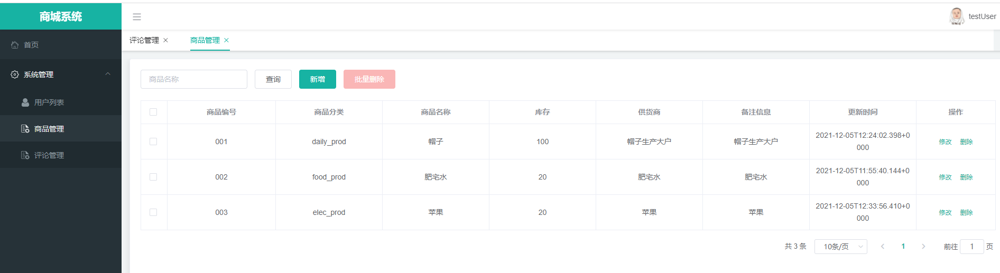

- 评论管理

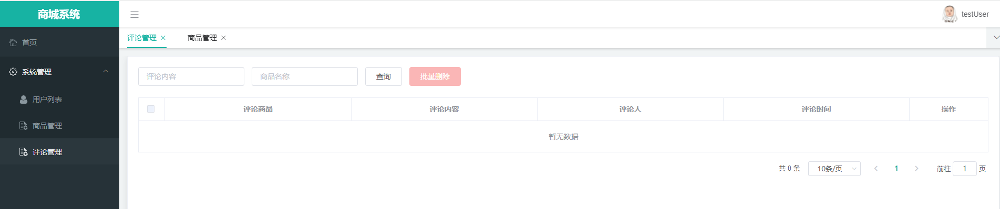

> 平台用户

- 查看商品信息


- 参与评论

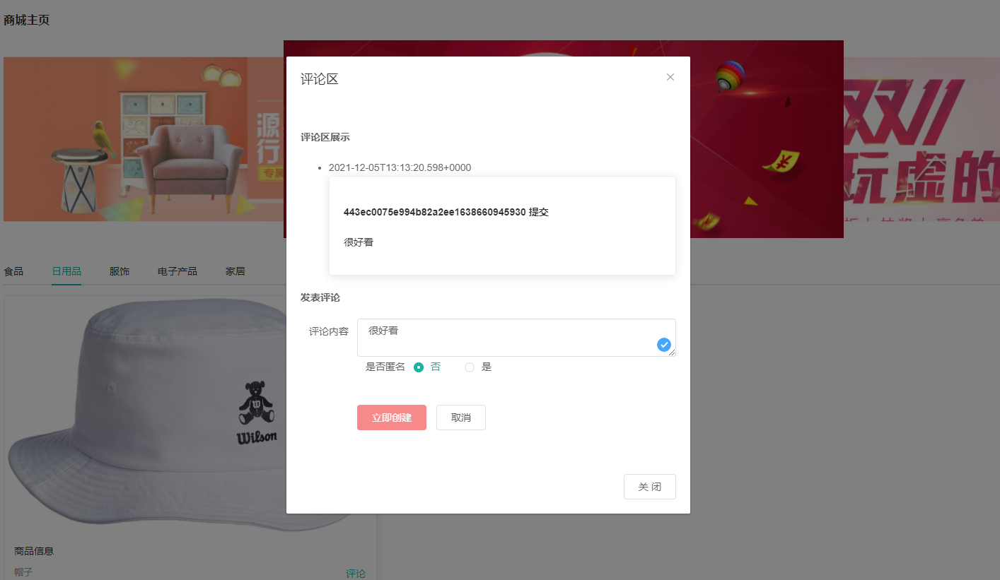
